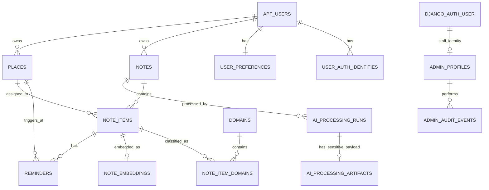

# Future-Proof Database Architecture Plan

## AI Context-Aware Note-Taking Web Application

**Status:** Final database design before Supabase Auth / Part 4  
**Primary application stack:** React + Django REST Framework + PostgreSQL + pgvector + Groq + Supabase Auth  
**Default timezone:** `Asia/Dhaka`  
**Default currency:** `BDT`  
**Primary design goal:** strong user isolation, private note content, stable UUID ownership, semantic retrieval, safe admin operations, and a schema that can grow without rewriting the ownership model.

---

# 1. Executive decision

The final database should use a **separate internal application-user UUID** as the owner of all user data.

Supabase Auth authenticates people, but Supabase's user UUID must **not** become the primary key copied into every Notes/Tasks/Expenses/Embeddings table. Instead, the application owns a stable `app_users.id` UUID and maps authenticated identities to it.

Recommended identity flow:

```text
Email/password ─┐
                │
Google OAuth ───┼──> Supabase Auth
                │        │
Future OAuth ───┘        │ JWT: iss + sub
                         v
                  user_auth_identities
                         │
                         v
                    app_users
                    UUID PK
                         │
       ┌─────────────────┼─────────────────────┐
       v                 v                     v
     notes             places             preferences
       │
       v
   note_items
       │
       ├── domains
       ├── reminders
       ├── embeddings
       └── AI processing history
```

This is deliberately different from the current Part 3 architecture, where Django's built-in `User` owns Notes. The current architecture is valid for Parts 1-3, but before Part 4 the ownership model should be migrated once, carefully, while the application is still small.

---

# 2. Non-negotiable architecture rules

1. **Every application-owned entity uses a UUID primary key** unless there is a strong reason not to.
2. `app_users.id` is the permanent internal owner ID.
3. Supabase Auth is an identity provider, not the application's relational root.
4. Google sign-in and email/password sign-in must resolve to the same application-user model.
5. The backend derives the user from a verified Supabase JWT. The frontend never gets to choose the authoritative `user_id`.
6. Every query for user-owned data is owner-scoped in the database query before serialization.
7. Raw Note text remains the source of truth.
8. AI output is derived data and may never overwrite the raw Note automatically.
9. One Note may produce many `NoteItem` rows.
10. `Type` and `Domain` remain separate concepts.
11. Embeddings are derived data and must be deleted/regenerated when their source changes.
12. BYOK/API keys are **not stored in the database in V1**.
13. Admin users may manage accounts and system operations, but admin interfaces must never expose note content, extracted item content, embeddings/RAG content, precise saved-place data, or user API keys.
14. Admin actions are audited.
15. Deleting a user eventually deletes all user-owned content and derived data.
16. No live GPS history is stored.
17. Sensitive content models are never registered directly in Django Admin.
18. Do not use PostgreSQL native ENUM types for application statuses. Use Django `TextChoices`/`CharField` plus check constraints so future value changes remain migration-friendly.
19. Timestamps are timezone-aware `TIMESTAMPTZ`.
20. Money uses `NUMERIC`, never float.

---

# 3. Important admin privacy boundary

The requirement "admin cannot see note content or API keys" is implemented as an **application/admin-interface security boundary**.

The admin website/API must not provide note text or other private content. Sensitive tables should not be directly registered in Django Admin, and admin serializers/services must expose safe metadata only.

However, a person with raw production database credentials, production shell access, server encryption keys, or unrestricted infrastructure access is outside this application-admin boundary and could technically access server-side data. Preventing even database/infrastructure operators from reading notes would require an end-to-end/zero-knowledge encryption architecture, which would materially change server-side Groq processing, semantic search, and RAG.

For this project, the correct goal is:

```text
Normal application admin
    CAN manage accounts/system status
    CANNOT read user content through the admin UI/API

Database/platform operator
    is a separate, highly privileged infrastructure role
    and is not equivalent to an application admin
```

---

# 4. Database platform decision

## Recommended target

- PostgreSQL
- `pgvector` extension
- Django ORM as the normal application data-access layer
- Supabase Auth for authentication
- Supabase Auth may be hosted separately from the application PostgreSQL database

The existing Part 6 deployment plan names Neon PostgreSQL. That remains compatible with Supabase Auth.

If Supabase Auth and application data are in **different databases**, there is no database-level foreign key to `auth.users`. This is why the application keeps an identity-mapping table.

If the project later moves the application database into Supabase PostgreSQL, the application-user abstraction should still remain; do not rewrite all ownership foreign keys to `auth.users`.

---

# 5. UUID strategy

Use UUIDs for all externally addressable and user-owned application entities.

Recommended Django default:

```python
id = models.UUIDField(primary_key=True, default=uuid.uuid4, editable=False)
```

UUIDv4 is chosen because it is simple, well-supported, and adequate for capstone/product scale. UUIDv7 may be evaluated later for write locality at large scale, but it is not necessary now and should not complicate migrations.

Primary UUID tables include:

- `app_users`
- `user_auth_identities`
- `user_preferences`
- `notes`
- `note_items`
- `note_item_domains`
- `ai_processing_runs`
- `ai_processing_artifacts`
- `note_embeddings`
- `places`
- `reminders`
- `admin_profiles`
- `admin_audit_events`
- optional future tags/attachments tables

`domains` may also use UUIDs for consistency.

Never expose sequential IDs as an authorization mechanism. UUIDs reduce easy enumeration, but **UUIDs do not replace authorization checks**.

---

# 6. Identity and authentication tables

## 6.1 `app_users`

This is the relational root for all end-user data.

| Column | Type | Null | Rules / purpose |
|---|---|---:|---|
| `id` | UUID | No | PK, application-owned identity |
| `email` | VARCHAR(320) | No | normalized email snapshot for account management |
| `display_name` | VARCHAR(120) | Yes | user-facing name |
| `status` | VARCHAR(24) | No | `ACTIVE`, `SUSPENDED`, `DELETION_PENDING`, `DELETED` |
| `timezone` | VARCHAR(64) | No | default `Asia/Dhaka` |
| `locale` | VARCHAR(16) | No | e.g. `en-BD` |
| `default_currency` | CHAR(3) | No | default `BDT` |
| `email_verified_at` | TIMESTAMPTZ | Yes | synchronized/observed verification time where available |
| `last_seen_at` | TIMESTAMPTZ | Yes | operational account activity only |
| `suspended_at` | TIMESTAMPTZ | Yes | set when application access is suspended |
| `deletion_requested_at` | TIMESTAMPTZ | Yes | deletion workflow |
| `created_at` | TIMESTAMPTZ | No | server generated |
| `updated_at` | TIMESTAMPTZ | No | server generated |
| `deleted_at` | TIMESTAMPTZ | Yes | account tombstone metadata only |

### Constraints

- unique normalized email for non-deleted accounts
- `status` limited by a check constraint
- email is not used as the true identity key

### Why email is not the PK

Emails change. OAuth providers change. The internal UUID should not.

---

## 6.2 `user_auth_identities`

Maps external authentication subjects to the stable application user.

| Column | Type | Null | Rules / purpose |
|---|---|---:|---|
| `id` | UUID | No | PK |
| `user_id` | UUID | No | FK -> `app_users.id`, `ON DELETE CASCADE` |
| `auth_system` | VARCHAR(32) | No | currently `SUPABASE` |
| `issuer` | VARCHAR(255) | No | JWT issuer (`iss`) |
| `subject` | VARCHAR(255) | No | JWT subject (`sub`), Supabase user UUID as text |
| `created_at` | TIMESTAMPTZ | No | mapping creation |
| `last_seen_at` | TIMESTAMPTZ | Yes | last successful authenticated use |

### Constraints

- `UNIQUE (issuer, subject)`
- index `user_id`
- no provider password/token is stored

### Auth resolution

```text
Authorization: Bearer <Supabase access token>
        │
        v
Django validates signature + issuer + expiry
        │
        v
read token iss + sub
        │
        v
user_auth_identities(issuer, subject)
        │
        v
app_users.id
        │
        v
request current application user
```

Google is not a separate application user. Google is an authentication method handled by Supabase. If Supabase links email/password and Google to one Supabase user, both resolve to the same `issuer + subject`, then to the same `app_users.id`.

---

## 6.3 `user_preferences`

One row per application user.

| Column | Type | Null | Notes |
|---|---|---:|---|
| `id` | UUID | No | PK |
| `user_id` | UUID | No | FK -> `app_users.id`, `ON DELETE CASCADE`, UNIQUE |
| `notification_enabled` | BOOLEAN | No | default false until user opts in |
| `time_reminders_enabled` | BOOLEAN | No | preference |
| `location_reminders_enabled` | BOOLEAN | No | default false |
| `daily_briefing_enabled` | BOOLEAN | No | preference |
| `week_starts_on` | SMALLINT | No | 0-6 constraint |
| `created_at` | TIMESTAMPTZ | No | |
| `updated_at` | TIMESTAMPTZ | No | |

Do not put arbitrary unvalidated application settings into one giant JSON blob when they have stable meanings.

---

# 7. Admin identity and permissions

End users and Django admins should be treated as separate security populations.

The existing Django authentication tables may remain for **staff/admin login only** after the Supabase migration.

Do not let public Supabase registration create Django staff users.

## 7.1 Django `auth_user`

After migration:

- reserved for staff/admin identities
- ordinary application users no longer depend on it
- `is_staff=true` is required for admin-site access
- public APIs never grant staff status

## 7.2 `admin_profiles`

| Column | Type | Null | Notes |
|---|---|---:|---|
| `id` | UUID | No | PK |
| `django_user_id` | integer/current Django user PK | No | ONE-TO-ONE -> Django staff user |
| `role` | VARCHAR(24) | No | `SUPER_ADMIN` or `ADMIN` |
| `is_active` | BOOLEAN | No | admin-specific disable switch |
| `created_by_admin_id` | UUID | Yes | self FK, `SET NULL` |
| `created_at` | TIMESTAMPTZ | No | |
| `updated_at` | TIMESTAMPTZ | No | |

### Role policy

#### `ADMIN`

May:

- list/search users by safe account metadata
- see user UUID, email, display name, account status, created date, last-seen date
- see counts such as number of notes/items/reminders, but not their contents
- suspend/unsuspend a user
- initiate account deletion or purge workflow
- resend/support account verification or password-reset workflow where appropriate
- view operational AI/search health statistics that contain no user content
- view aggregate product metrics

May not:

- read `notes.raw_text`
- read NoteItem titles, summaries, normalized text, amounts, dates, place hints, or metadata
- inspect vector values or canonical embedded text
- inspect RAG questions/answers/source content
- inspect raw/parsed AI responses containing note data
- inspect precise saved-place coordinates or addresses
- see personal Groq/BYOK keys
- create/promote/deactivate other admins

#### `SUPER_ADMIN`

Has all safe `ADMIN` abilities plus:

- create another admin manually
- change admin role
- deactivate/reactivate admin access
- review admin audit history
- manage safe global configuration such as Domain vocabulary if the project chooses to expose it

`SUPER_ADMIN` still must **not** receive user note content or API keys through the admin application.

---

## 7.3 `admin_audit_events`

Append-only security/audit trail.

| Column | Type | Null | Notes |
|---|---|---:|---|
| `id` | UUID | No | PK |
| `actor_admin_id` | UUID | Yes | FK -> `admin_profiles.id`, `SET NULL` |
| `action` | VARCHAR(64) | No | e.g. `USER_SUSPENDED`, `ADMIN_CREATED` |
| `target_user_id` | UUID | Yes | FK -> `app_users.id`, `SET NULL` |
| `target_admin_id` | UUID | Yes | FK -> `admin_profiles.id`, `SET NULL` |
| `target_ref_hash` | VARCHAR(128) | Yes | permits post-deletion audit correlation without keeping content |
| `reason` | VARCHAR(500) | Yes | safe human-entered reason; prohibit note content |
| `metadata` | JSONB | No | allow-list safe keys only |
| `ip_hash` | VARCHAR(128) | Yes | optional privacy-preserving audit field |
| `created_at` | TIMESTAMPTZ | No | immutable |

### Rules

- no UPDATE/DELETE through normal application code
- no note text, API keys, raw tokens, OAuth tokens, precise coordinates, or other secrets in `metadata`
- all privilege-changing admin actions require an audit row

---

# 8. Core note tables

## 8.1 `notes`

Raw note is the user's source of truth.

| Column | Type | Null | Notes |
|---|---|---:|---|
| `id` | UUID | No | PK |
| `user_id` | UUID | No | FK -> `app_users.id`, `ON DELETE CASCADE` |
| `raw_text` | TEXT | No | **sensitive user content** |
| `processing_status` | VARCHAR(24) | No | `UNPROCESSED`, `PROCESSING`, `REVIEW_REQUIRED`, `PROCESSED`, `FAILED` |
| `is_archived` | BOOLEAN | No | default false |
| `revision` | BIGINT | No | optimistic concurrency; default 0 |
| `analysis_started_at` | TIMESTAMPTZ | Yes | processing lease |
| `created_at` | TIMESTAMPTZ | No | |
| `updated_at` | TIMESTAMPTZ | No | |

### Rules

- `raw_text` non-blank
- client cannot submit `user_id`
- owner comes from verified authenticated identity
- note edit increments `revision`
- note delete is a **hard content delete** in V1 so derived data cascades cleanly
- archive is the reversible alternative to deletion

### Indexes

- `(user_id, created_at DESC)`
- `(user_id, is_archived, created_at DESC)`
- `(user_id, processing_status)`

---

## 8.2 `note_items`

Structured facts/actions extracted from Notes and confirmed/edited by the user.

| Column | Type | Null | Notes |
|---|---|---:|---|
| `id` | UUID | No | PK |
| `note_id` | UUID | No | FK -> `notes.id`, `ON DELETE CASCADE` |
| `analysis_run_id` | UUID | Yes | FK -> `ai_processing_runs.id`, `SET NULL` |
| `item_type` | VARCHAR(20) | No | `TASK`, `EVENT`, `EXPENSE`, `INFORMATION` |
| `title` | VARCHAR(255) | No | **sensitive content** |
| `summary` | TEXT | Yes | **sensitive content** |
| `normalized_text` | TEXT | Yes | **sensitive content** |
| `start_date` | DATE | Yes | date-only when time unknown |
| `due_date` | DATE | Yes | date-only when time unknown |
| `start_datetime` | TIMESTAMPTZ | Yes | explicit timed start |
| `due_datetime` | TIMESTAMPTZ | Yes | explicit timed due |
| `amount` | NUMERIC(18,4) | Yes | never float |
| `currency` | CHAR(3) | Yes | ISO-like uppercase code e.g. BDT |
| `quantity` | NUMERIC(18,6) | Yes | |
| `unit` | VARCHAR(32) | Yes | normalized unit |
| `place_hint` | VARCHAR(255) | Yes | AI/user free-text hint; not authoritative saved Place |
| `assigned_place_id` | UUID | Yes | FK -> `places.id`, `SET NULL` |
| `status` | VARCHAR(20) | No | `PENDING`, `COMPLETED`, `CANCELLED`, `ARCHIVED` |
| `importance` | VARCHAR(12) | No | `LOW`, `NORMAL`, `HIGH` |
| `confidence` | NUMERIC(5,4) | Yes | check 0..1; UI review signal only |
| `is_confirmed` | BOOLEAN | No | draft vs approved |
| `metadata` | JSONB | No | default `{}`; schema/size validation |
| `created_at` | TIMESTAMPTZ | No | |
| `updated_at` | TIMESTAMPTZ | No | |

### Important date rule

Never invent midnight when only a date is known.

```text
known date, unknown time -> due_date/start_date
known date + time        -> due_datetime/start_datetime
```

### `assigned_place_id` decision

This is the canonical saved-place assignment for Tasks/Shopping grouping.

- `place_hint` = untrusted text suggestion from AI/user note
- `assigned_place_id` = confirmed relation to a user's saved Place

A location Reminder may also reference a Place. Those are separate concepts:

```text
note_item.assigned_place -> where the item belongs / shopping grouping
reminder.place           -> where a location trigger should fire
```

The UI can default a new location reminder to the assigned place, but the DB should not silently infer one from the other.

### Constraints

- `confidence IS NULL OR 0 <= confidence <= 1`
- amount/quantity non-negative where appropriate
- currency uppercase validation at API/model layer
- an `assigned_place_id` must belong to the same application user as the Note; enforce in service/serializer and tests

### Indexes

- `(note_id, is_confirmed)`
- `(item_type, status)`
- `(status, due_datetime)`
- `(status, due_date)`
- `(start_datetime)`
- `(assigned_place_id, status)`

User filtering still joins through `note_id -> notes.user_id`.

---

# 9. Domains and categorization

## 9.1 `domains`

Global controlled vocabulary.

Seed values:

- Education
- Shopping
- Finance
- Work
- Personal
- Health
- Entertainment
- Travel
- Other

| Column | Type | Null | Notes |
|---|---|---:|---|
| `id` | UUID | No | PK |
| `name` | VARCHAR(80) | No | UNIQUE |
| `slug` | VARCHAR(80) | No | UNIQUE, lowercase |
| `is_active` | BOOLEAN | No | allows retirement without breaking history |
| `sort_order` | SMALLINT | No | UI ordering |
| `created_at` | TIMESTAMPTZ | No | |

Domains are not owned by individual users in V1.

---

## 9.2 `note_item_domains`

Explicit through table instead of an opaque implicit M2M table.

| Column | Type | Null | Notes |
|---|---|---:|---|
| `id` | UUID | No | PK |
| `note_item_id` | UUID | No | FK -> `note_items.id`, `ON DELETE CASCADE` |
| `domain_id` | UUID | No | FK -> `domains.id`, `RESTRICT` |
| `is_primary` | BOOLEAN | No | reporting/category primary domain |
| `source` | VARCHAR(12) | No | `AI` or `USER` |
| `created_at` | TIMESTAMPTZ | No | |

### Constraints

- `UNIQUE (note_item_id, domain_id)`
- at most one `is_primary=true` row per NoteItem via partial unique index

### Why primary domain matters

An Expense may belong to both `Shopping` and `Finance`. The expense dashboard must not double-count it. Use exactly one primary reporting domain where a primary category is needed.

Example:

```text
Books ৳250
Domains: Education + Finance
Primary reporting domain: Education
```

The amount contributes once.

---

# 10. AI processing tables

The current project stores AI request/response data for retry analysis and correction evaluation. This remains useful, but the admin privacy requirement means content must be separated from operational metadata.

## 10.1 `ai_processing_runs`

Safe-ish operational metadata. Admin may see selected fields through a dedicated safe view/serializer.

| Column | Type | Null | Notes |
|---|---|---:|---|
| `id` | UUID | No | PK |
| `note_id` | UUID | No | FK -> `notes.id`, `ON DELETE CASCADE` |
| `source_run_id` | UUID | Yes | self FK, `SET NULL` for retry/re-analysis lineage |
| `operation` | VARCHAR(32) | No | `ANALYZE`, `REANALYZE`, `CONFIRM`, etc. |
| `provider` | VARCHAR(32) | No | `GROQ` |
| `model_name` | VARCHAR(128) | No | |
| `prompt_version` | VARCHAR(32) | No | |
| `note_revision` | BIGINT | No | revision analyzed |
| `credential_source` | VARCHAR(24) | No | `USER_SESSION`, `SERVER`, `NONE`; never the key |
| `status` | VARCHAR(20) | No | `STARTED`, `SUCCEEDED`, `FAILED`, `DISCARDED` |
| `error_code` | VARCHAR(64) | Yes | sanitized |
| `error_message` | VARCHAR(500) | Yes | sanitized; no provider secrets/content |
| `latency_ms` | INTEGER | Yes | operational metric |
| `input_chars` | INTEGER | Yes | count only |
| `output_chars` | INTEGER | Yes | count only |
| `created_at` | TIMESTAMPTZ | No | |
| `completed_at` | TIMESTAMPTZ | Yes | |

### Admin visibility

Admin may see:

- run UUID
- user UUID or pseudonymous user reference if needed
- status
- provider/model/prompt version
- latency
- sanitized error code
- created/completed times

Admin must not see note content or AI payload artifacts.

---

## 10.2 `ai_processing_artifacts`

**Sensitive. Never register directly in Django Admin.**

| Column | Type | Null | Notes |
|---|---|---:|---|
| `id` | UUID | No | PK |
| `run_id` | UUID | No | ONE-TO-ONE FK -> `ai_processing_runs.id`, `ON DELETE CASCADE` |
| `input_snapshot` | TEXT | Yes | optional historical note revision; sensitive |
| `raw_response` | JSONB/TEXT | Yes | bounded/redacted provider response; sensitive |
| `parsed_response` | JSONB | Yes | validated prediction; sensitive |
| `confirmed_response` | JSONB | Yes | approved correction snapshot; sensitive |
| `created_at` | TIMESTAMPTZ | No | |

### Data minimization

If `input_snapshot` is not necessary because note-revision history is not implemented, omit it rather than duplicating raw Note text.

Provider responses must be size-limited. No API key, JWT, cookie, Authorization header, or secret may ever be written here.

---

# 11. BYOK / provider credentials

## V1 decision: no user API-key database table

The existing session-only BYOK design should remain:

```text
User types Groq key
  -> React memory only
  -> X-Groq-Api-Key on analyze request only
  -> Django uses it for that request
  -> key is never persisted
```

Therefore:

**Do not create a `user_api_keys` table for current V1.**

This gives the strongest possible admin guarantee: there is no user BYOK key in the DB for an admin to retrieve.

## Optional future persistent BYOK

Only if the product later explicitly requires saved provider credentials, create something like `user_provider_credentials` with:

- UUID PK
- user FK
- provider
- encrypted ciphertext only
- key version
- masked suffix for user UI if useful
- timestamps

Use application/envelope encryption with the encryption key outside the database. Never allow Django Admin to display ciphertext or plaintext. Do not implement this table now.

---

# 12. Embeddings / semantic memory

## 12.1 `note_embeddings`

One current embedding per confirmed NoteItem for V1.

| Column | Type | Null | Notes |
|---|---|---:|---|
| `id` | UUID | No | PK |
| `note_item_id` | UUID | No | ONE-TO-ONE FK -> `note_items.id`, `ON DELETE CASCADE` |
| `embedding` | VECTOR(384) | No | Part 4 model dimension |
| `embedding_model` | VARCHAR(128) | No | initially `sentence-transformers/all-MiniLM-L6-v2` |
| `embedding_version` | SMALLINT | No | canonical-text recipe version |
| `content_hash` | CHAR(64) | No | SHA-256 of canonical searchable source |
| `source_updated_at` | TIMESTAMPTZ | No | stale-vector detection |
| `created_at` | TIMESTAMPTZ | No | |
| `updated_at` | TIMESTAMPTZ | No | |

### Do not store raw embedding source text unless required

The canonical text can be reconstructed from the NoteItem and Note. Storing only `content_hash` reduces duplicate sensitive text.

If debugging later proves an `embedded_text` snapshot is essential, treat it as private user content and keep it out of admin surfaces.

### Lifecycle

- create when a NoteItem becomes confirmed
- regenerate when meaningful searchable fields change
- delete on NoteItem deletion through cascade
- exclude unconfirmed/cancelled/archived content as defined by search rules
- provide idempotent `rebuild_embeddings` management command

### Search ownership

Never do this:

```text
nearest vectors across everyone -> Python filter by user
```

Do this:

```text
DB query joins embedding -> item -> note
WHERE note.user_id = current_user.id
AND item.is_confirmed = true
...
ORDER BY cosine distance
LIMIT K
```

For the capstone dataset, exact nearest-neighbor search is acceptable and easiest to validate. Add HNSW with cosine operator class only when the dataset justifies it; approximate indexes trade recall for speed and filtered multi-user vector search needs careful testing.

---

# 13. Places and location privacy

## 13.1 `places`

**Sensitive user data. Admin should see count/status only, not coordinates/address.**

| Column | Type | Null | Notes |
|---|---|---:|---|
| `id` | UUID | No | PK |
| `user_id` | UUID | No | FK -> `app_users.id`, `ON DELETE CASCADE` |
| `name` | VARCHAR(160) | No | user-defined |
| `latitude` | NUMERIC(9,6) | No | approx sub-meter precision is unnecessary; 6 decimals is adequate for app use |
| `longitude` | NUMERIC(9,6) | No | |
| `address` | VARCHAR(500) | Yes | optional sensitive text |
| `default_radius_m` | INTEGER | No | positive constrained range |
| `created_at` | TIMESTAMPTZ | No | |
| `updated_at` | TIMESTAMPTZ | No | |

### Constraints

- latitude between -90 and 90
- longitude between -180 and 180
- radius sensible range, e.g. 25-10000 m

### Indexes

- `(user_id, name)`
- `user_id`

Do not store movement history or periodic GPS samples.

---

# 14. Reminders

## 14.1 `reminders`

| Column | Type | Null | Notes |
|---|---|---:|---|
| `id` | UUID | No | PK |
| `note_item_id` | UUID | No | FK -> `note_items.id`, `ON DELETE CASCADE` |
| `trigger_type` | VARCHAR(12) | No | `TIME` or `LOCATION` |
| `scheduled_at` | TIMESTAMPTZ | Yes | required for TIME |
| `place_id` | UUID | Yes | FK -> `places.id`, `CASCADE` or `SET NULL` per final policy below |
| `radius_m` | INTEGER | Yes | required for LOCATION |
| `is_enabled` | BOOLEAN | No | |
| `last_triggered_at` | TIMESTAMPTZ | Yes | |
| `triggered_count` | INTEGER | No | default 0 |
| `created_at` | TIMESTAMPTZ | No | |
| `updated_at` | TIMESTAMPTZ | No | |

### Validation

```text
TIME:
  scheduled_at required
  place_id/radius_m must be null unless future combined reminders are explicitly designed

LOCATION:
  place_id required
  radius_m required and positive
```

A Reminder's NoteItem and Place must belong to the same `app_user`.

### Place deletion policy

Recommended: `ON DELETE CASCADE` from Place to LOCATION reminders, because a location reminder with no place is invalid. Deleting a Place should require a confirmation message that dependent location reminders will be deleted and shopping assignments will be cleared (`note_items.assigned_place_id` uses `SET NULL`).

### Indexes

- `(note_item_id, is_enabled)`
- `(trigger_type, is_enabled, scheduled_at)`
- `(place_id, is_enabled)`

---

# 15. Optional user tags (future extension, not required before Part 4)

Domains are system vocabulary. Tags are user vocabulary. Do not mix them.

If custom tagging is later needed:

## `tags`

- `id UUID PK`
- `user_id FK -> app_users`
- `name`
- normalized name
- timestamps
- unique `(user_id, normalized_name)`

## `note_tags`

- `id UUID PK`
- `note_id FK -> notes`
- `tag_id FK -> tags`
- unique `(note_id, tag_id)`

Do not implement until a real product requirement exists.

---

# 16. Optional attachments (future extension, not V1)

Do not store binary files directly in PostgreSQL.

If attachments are later added, store object-storage metadata only:

- UUID
- user ID
- note ID
- storage object key
- original filename
- MIME type
- byte size
- checksum
- timestamps

Attachment objects must use private storage and user-scoped signed access. OCR remains outside current scope.

---

# 17. What should NOT become separate tables

To avoid overengineering:

## No separate Task/Event/Expense/Grocery tables in V1

Use `note_items.item_type` plus typed columns.

```text
TASK / EVENT / EXPENSE / INFORMATION
```

This preserves the project's existing simple model and avoids one-table-per-type inheritance.

If a future type acquires many truly type-specific fields, add a one-to-one extension table at that time without changing the core NoteItem ID.

## No grocery table

Shopping items are:

```text
confirmed NoteItem
item_type = TASK
Shopping domain
```

## No current API-key table

BYOK remains session-only.

## No GPS-history table

The product explicitly does not store movement history.

## No generic catch-all `events` audit table containing user content

Admin/system logs must contain metadata only.

---

# 18. Complete relationship map

```text
                    SUPABASE AUTH
                 JWT issuer + subject
                          │
                          v
              user_auth_identities
                    many : 1
                          │
                          v
                     app_users
                    UUID primary
          ┌───────────────┼───────────────────────┐
          │               │                       │
          v               v                       v
 user_preferences       notes                   places
                          │                       │
                          │ 1                     │
                          v many                  │
                     note_items                  │
                  ┌───────┼──────────────┐        │
                  │       │              │        │
                  v       v              v        │
         note_item_domains reminders  embeddings  │
                  │          │            │        │
                  v          └──── place ─┘?       │
               domains             │              │
                                   └──────────────┘

notes
  │
  └── ai_processing_runs
          │
          └── ai_processing_artifacts (sensitive)

Django auth_user (staff only)
  │ 1:1
  v
admin_profiles
  │
  └── admin_audit_events
```

Note: `note_items.assigned_place_id` points to `places`; embeddings do not point to Place.

---

# 19. Delete and cascade policy

Deletion behavior must be deliberate.

| Parent delete | Child behavior | Reason |
|---|---|---|
| `app_users` | CASCADE user-owned content | user data purge |
| `notes` | CASCADE NoteItems + AI runs | derived data has no meaning without note |
| `note_items` | CASCADE domains join + embeddings + reminders | derived data |
| `ai_processing_runs` | CASCADE artifact | artifact has no independent meaning |
| `places` | SET NULL on `note_items.assigned_place_id` | task may still exist |
| `places` | CASCADE LOCATION reminders | location reminder invalid without place |
| `domains` | RESTRICT while referenced | preserve historical categorization |
| staff/admin deletion | audit actor SET NULL | preserve audit event |

Before deleting an `app_user`, coordinate deletion with Supabase Auth. Removing only the local application row is not enough to prevent future authentication; deleting/suspending the corresponding auth identity must be handled through trusted server-side Supabase admin APIs as part of the account lifecycle.

---

# 20. Account lifecycle

## Registration / first sign-in

```text
Supabase authenticates user
    ↓
Django verifies Supabase JWT
    ↓
lookup user_auth_identities(iss, sub)
    ↓
missing?
    ├─ yes -> create app_users + identity + preferences transactionally
    └─ no  -> load existing app_user
    ↓
continue request
```

Do not let the client submit an arbitrary application-user UUID during provisioning.

## Suspension

Admin suspension should do two things:

1. set `app_users.status = SUSPENDED`
2. use trusted backend Supabase admin capability to block/ban new authentication as appropriate

Every authenticated backend request should also reject a non-`ACTIVE` application user, so an already-issued short-lived access token cannot bypass the local account status check.

## Deletion

Recommended workflow:

```text
ACTIVE
  -> DELETION_PENDING
  -> revoke/disable auth access
  -> purge app user row (cascades private content)
  -> delete/soft-delete Supabase auth user as chosen
  -> retain only content-free admin audit event
```

The exact retention/grace period can remain a configuration/policy decision.

---

# 21. Admin-safe features required by this project

## User management

Admin UI may provide:

- search by email/user UUID
- account creation date
- last-seen date
- status
- email verification status
- note count
- confirmed NoteItem count
- reminder count
- place count
- embedding count/status count
- suspend / unsuspend
- initiate user deletion
- resend supported verification/reset action
- force account re-authentication/session-revocation action where supported

Admin UI must **not** provide "View Note", "View NoteItem", "View embedding", "View AI response", "View saved coordinates", or similar links.

## Admin management

Only `SUPER_ADMIN` may:

- add a new admin manually
- deactivate an admin
- promote/demote `ADMIN` <-> `SUPER_ADMIN` according to policy

Recommended guardrails:

- an admin cannot deactivate themselves if they are the last active `SUPER_ADMIN`
- creating/changing admin roles writes an `admin_audit_events` row
- public registration never creates staff accounts
- do not store default admin passwords in fixtures/source control

## Operational dashboard

Safe metrics only, e.g.:

- total users / active / suspended
- registrations by day
- notes created count by day (count only)
- AI analyze success/failure rate
- average AI latency
- embeddings missing/stale count
- reminder count / trigger failure count if later server-tracked
- application version/migration state

No user content samples.

## Domain vocabulary

`SUPER_ADMIN` may optionally enable/disable/reorder predefined Domains. Deleting a referenced Domain should be blocked.

---

# 22. Safe admin projections/views

Do not reuse end-user serializers in admin code.

Create dedicated admin queries/serializers that select only safe fields.

Conceptual safe user projection:

```text
user_id
email
display_name
status
created_at
last_seen_at
email_verified_at
note_count
item_count
place_count
reminder_count
embedding_count
```

Do not join/select:

```text
notes.raw_text
note_items.title
note_items.summary
note_items.normalized_text
note_items.amount
note_items.place_hint
places.latitude
places.longitude
places.address
note_embeddings.embedding
ai_processing_artifacts.*
```

For stronger defense in depth, a PostgreSQL view such as `admin_user_overview` may expose only the safe projection and counts. The Django admin service can query the view instead of sensitive tables for ordinary admin screens.

---

# 23. RAG/search privacy model

Semantic search and RAG are always user-scoped.

## Semantic retrieval

```text
current app_user.id
  + query embedding
  ↓
filter rows to that user's confirmed searchable NoteItems
  ↓
rank vectors
  ↓
return user's results only
```

## RAG

```text
question
  ↓
retrieve current user's NoteItems only
  ↓
build bounded context
  ↓
Groq
  ↓
validate returned source IDs are in retrieved set
  ↓
answer + sources
```

No admin-facing RAG over customer data.

Do not persist raw RAG questions/answers by default. If product analytics later needs them, require an explicit privacy decision and separate sensitive logging design.

---

# 24. Recommended indexes

## Identity

```text
app_users(email)
app_users(status, created_at)
user_auth_identities(issuer, subject) UNIQUE
user_auth_identities(user_id)
```

## Notes

```text
notes(user_id, created_at DESC)
notes(user_id, is_archived, created_at DESC)
notes(user_id, processing_status)
```

## NoteItems

```text
note_items(note_id, is_confirmed)
note_items(item_type, status)
note_items(status, due_datetime)
note_items(status, due_date)
note_items(assigned_place_id, status)
```

## Domains

```text
domains(slug) UNIQUE
note_item_domains(note_item_id, domain_id) UNIQUE
note_item_domains(domain_id, note_item_id)
partial unique: one primary domain per note_item
```

## AI

```text
ai_processing_runs(note_id, created_at DESC)
ai_processing_runs(status, created_at DESC)
ai_processing_runs(provider, model_name, created_at DESC)
```

## Embeddings

```text
note_embeddings(note_item_id) UNIQUE
note_embeddings(content_hash)
```

Start with exact pgvector search. At larger scale evaluate:

```sql
USING hnsw (embedding vector_cosine_ops)
```

after measuring retrieval quality under user filtering.

## Places/reminders

```text
places(user_id, name)
reminders(note_item_id, is_enabled)
reminders(trigger_type, is_enabled, scheduled_at)
reminders(place_id, is_enabled)
```

## Admin

```text
admin_profiles(django_user_id) UNIQUE
admin_audit_events(actor_admin_id, created_at DESC)
admin_audit_events(target_user_id, created_at DESC)
admin_audit_events(action, created_at DESC)
```

---

# 25. Concurrency and consistency

The existing `Note.revision` mechanism should remain.

Use optimistic concurrency for operations that derive data from a note:

```text
client sends note revision
backend claims/processes revision
AI executes outside long DB lock
before commit, verify revision is still current
stale result -> discard
```

Use `transaction.atomic()` for logically indivisible operations such as:

- first authenticated user provisioning
- replacing validated AI draft items
- confirming a complete review set
- admin role changes + audit event
- account status changes + audit row where local-only portion is atomic

External Supabase calls cannot be in the same database transaction. Treat them as an orchestration workflow with explicit failure handling and audit status.

---

# 26. JSONB policy

Use typed relational columns for values the application filters, sorts, validates, or aggregates.

Use JSONB only for bounded extensibility.

Good JSONB uses:

- limited NoteItem extraction metadata
- admin audit safe metadata
- AI validated snapshots/artifacts

Bad JSONB uses:

- putting all user settings in one blob
- storing tasks/events/expenses as arbitrary JSON instead of columns
- storing ownership inside JSON
- storing secrets

Enforce request-size and JSON-depth/shape limits at the API/service layer.

---

# 27. Money and numeric rules

## Expenses

- `amount NUMERIC(18,4)`
- `currency CHAR(3)`
- normalize common taka strings to `BDT`
- never perform totals using float

## Quantities

- `quantity NUMERIC(18,6)`
- normalized text unit in `unit`

Expense aggregation uses confirmed `EXPENSE` NoteItems only and one primary reporting Domain to avoid double-counting.

---

# 28. Date/time rules

Store timezone-aware timed values as `TIMESTAMPTZ`.

Store date-only statements as `DATE`.

Do not convert:

```text
"September 23"
```

into:

```text
September 23 00:00
```

unless midnight was actually stated or business logic explicitly requires a derived UI boundary.

User timezone belongs in `app_users.timezone`; default `Asia/Dhaka`.

---

# 29. Database privacy classification

## Class A — highly sensitive content

Never expose through admin UI:

- `notes.raw_text`
- NoteItem title/summary/normalized text
- money/details derived from notes
- `place_hint`
- precise Place coordinates/address
- AI artifact payloads
- RAG context/questions/answers if ever persisted
- embedding vector/source text
- authentication tokens
- BYOK keys

## Class B — account PII

Admin may see only as necessary for user management:

- email
- display name
- user UUID
- account timestamps/status

## Class C — operational metadata

Admin may see:

- counts
- processing status
- model name/version
- sanitized error code
- latency
- migration/health state

Document this classification in code/admin serializer tests.

---

# 30. Database access rules

## End-user application APIs

- authenticate Supabase JWT
- map external identity to `app_users`
- query user-owned rows with DB filters
- never accept authoritative ownership ID from client

## Admin APIs/UI

- Django session + CSRF
- require `admin_profiles.is_active`
- role-check every action
- dedicated safe serializers
- no sensitive models registered directly
- audit every privilege/account action

## Background/management commands

- run with server-side database credentials
- still use deliberate scoping
- never dump private content into logs

## Frontend

Safe:

- Supabase project URL
- Supabase publishable key

Never frontend:

- Supabase secret/service-role key
- database password
- Django secret key
- Groq server key
- saved user BYOK key

---

# 31. Supabase-specific security decisions

1. Supabase secret/admin credentials are server-only.
2. Backend validates Supabase access JWTs and uses JWT subject/issuer to resolve `app_users`.
3. Backend checks local application status on every authenticated request.
4. Google OAuth is configured through Supabase Auth, not implemented separately in Django.
5. Admin-only Supabase operations such as creating/deleting/banning auth users occur from trusted backend code only.
6. If application data later lives in Supabase PostgreSQL and is exposed through the Supabase Data API, explicitly configure grants + RLS. Do not assume RLS alone removes table privileges.
7. If Django remains the exclusive data API, consider disabling/restricting Supabase Data API access to application content rather than exposing a second data-access path.

---

# 32. Migration from the current Part 3 database

## Current state to preserve

Current project has:

- Django built-in User with integer PK
- Notes owned by Django User
- Note -> many NoteItem
- NoteItem <-> many Domain
- AIProcessingLog containing processing payloads
- session-only BYOK
- SQLite development database

The migration should happen **before Part 4**, because Part 4 introduces PostgreSQL, embeddings, and additional foreign-key dependencies.

## Critical rule

Do **not** casually delete migrations, reset the DB, or discard data.

OpenCode must first determine whether current data is disposable development data or data that must be preserved.

## Recommended data-preserving phases

### Phase 1 — schema preparation while still preserving current behavior

1. Create `AppUser` with UUID PK.
2. Create `UserAuthIdentity`.
3. Create `UserPreferences`.
4. Add a temporary `legacy_django_user_id` mapping field or migration mapping mechanism.
5. Backfill one `AppUser` for each existing ordinary Django User.
6. Keep staff/superusers separate for admin use.

### Phase 2 — ownership migration

1. Add nullable `app_user_id` FK to `Note`.
2. Backfill from old `Note.user_id` through the migration map.
3. Verify every Note has exactly one AppUser owner.
4. Make `app_user_id` non-null.
5. Update all runtime ownership logic/tests to AppUser.
6. Only after verification remove the old end-user ownership FK.

Children already flow through Note ownership, so they do not all need a redundant `user_id`.

### Phase 3 — UUID conversion for existing content entities

Target final schema uses UUID PKs for Notes/NoteItems/AI runs. Changing live primary keys with dependent FKs is a high-risk migration.

OpenCode must inspect the actual migration state and choose one of:

- data-preserving table-copy/backfill migration, or
- clean development rebuild **only if the owner explicitly confirms the existing local data can be discarded**.

Do not guess.

### Phase 4 — split AI log metadata from artifacts

Migrate current AIProcessingLog fields into:

```text
ai_processing_runs          -> operation/model/status/error/timestamps
ai_processing_artifacts     -> raw/parsed/confirmed sensitive payloads
```

Do not expose the artifact model in Django Admin.

### Phase 5 — Supabase identity transition

1. Implement JWT verifier/authentication class.
2. On authenticated Supabase user, map `iss + sub` to `UserAuthIdentity`.
3. Provide controlled migration/linking for existing users.
4. Never auto-merge two accounts solely because a client submitted the same email.
5. A one-time legacy link may use a **verified** normalized email only when there is exactly one unambiguous legacy account and explicit migration logic/tests protect collisions.
6. Disable old public Django email/password authentication after Supabase migration is verified.
7. Keep Django staff auth for `/admin/`.

### Phase 6 — PostgreSQL / Part 4

After identity/ownership tests pass:

1. migrate SQLite -> PostgreSQL
2. enable pgvector
3. add NoteEmbedding
4. backfill embeddings
5. implement semantic search/RAG

---

# 33. User-isolation invariants to test

Every release must verify:

- User A cannot list User B Notes.
- User A cannot fetch User B Note by UUID.
- User A cannot update/delete User B Note.
- User A cannot analyze/confirm User B Note.
- User A cannot retrieve User B NoteItems.
- User A cannot attach User B Place to an item/reminder.
- User A cannot read/update/delete User B Place/Reminder.
- semantic search filters by owner in SQL/ORM before ranking exposure.
- RAG context contains only current user's retrieved rows.
- returned RAG source IDs are validated against the retrieved current-user set.
- deleting a Note removes its derived NoteItems, embeddings, reminders and AI artifacts according to cascade policy.
- suspended application users are rejected even when they still hold an unexpired access JWT.

---

# 34. Admin privacy tests

Automated tests must assert that normal admin screens/APIs cannot retrieve private content.

Required tests:

1. admin user list contains account metadata but no `raw_text`.
2. admin user detail contains counts but no note titles/content.
3. sensitive Note/NoteItem/AIArtifact/Embedding models are not directly registered in admin.
4. admin search cannot search note text.
5. admin cannot access a guessed sensitive-object admin URL.
6. admin endpoints never serialize vector fields.
7. admin endpoints never serialize Place latitude/longitude/address.
8. no API key or secret field exists in V1 database models.
9. AI operational errors are sanitized before admin display.
10. only `SUPER_ADMIN` can create/change/deactivate admins.
11. admin role/action changes generate immutable audit events.
12. public registration cannot create staff/admin accounts.

---

# 35. Model-level constraints worth implementing

Use database constraints in addition to serializer validation when practical.

Examples:

```text
NoteItem confidence: 0 <= confidence <= 1
Place latitude: -90 <= latitude <= 90
Place longitude: -180 <= longitude <= 180
Place radius: > 0
Reminder TIME -> scheduled_at IS NOT NULL
Reminder LOCATION -> place_id IS NOT NULL AND radius_m IS NOT NULL
Reminder triggered_count >= 0
one primary Domain per NoteItem
unique identity issuer + subject
one UserPreferences row per AppUser
one NoteEmbedding per NoteItem
one AIProcessingArtifact per AIProcessingRun
```

Do not rely on frontend validation for integrity.

---

# 36. Suggested Django app ownership

Keep apps understandable rather than creating one app per table.

```text
backend/
  accounts/
    models.py
      AppUser
      UserAuthIdentity
      UserPreferences
    authentication.py
      Supabase JWT authentication
    services/
      provisioning.py
      account_lifecycle.py

  admin_portal/           # or carefully scoped Django admin configuration
    models.py
      AdminProfile
      AdminAuditEvent
    services/
      admin_users.py
    admin.py

  notes/
    models.py
      Note
      NoteItem
      Domain
      NoteItemDomain

  ai/
    models.py
      AIProcessingRun
      AIProcessingArtifact
    services/
      groq_service.py

  search/
    models.py
      NoteEmbedding
    services/
      embedding_service.py
      retrieval_service.py

  context/                # name may be places/reminders instead
    models.py
      Place
      Reminder
```

Do not create apps solely for visual neatness if existing project organization has a better simple structure.

---

# 37. Final target table inventory

## Implement before / with Supabase Auth migration

1. `app_users`
2. `user_auth_identities`
3. `user_preferences`
4. `admin_profiles`
5. `admin_audit_events`
6. migrated `notes`
7. migrated `note_items`
8. `domains`
9. explicit `note_item_domains`
10. `ai_processing_runs`
11. `ai_processing_artifacts`

## Part 4

12. `note_embeddings`

## Part 5

13. `places`
14. `reminders`

## Optional future only

15. `tags`
16. `note_tags`
17. attachment metadata table
18. encrypted persistent provider credential table only if product scope later changes

This is intentionally not dozens of speculative tables.

---

# 38. ERD — target logical model



---

# 39. Final ownership rule

The most important database invariant in the entire project is:

```text
all user-owned information ultimately reaches exactly one app_users.id
```

Examples:

```text
Note -> app_user
NoteItem -> Note -> app_user
Embedding -> NoteItem -> Note -> app_user
Reminder -> NoteItem -> Note -> app_user
Place -> app_user
AI Run -> Note -> app_user
```

This is what semantic search, RAG, reminders, and admin privacy checks should build around.

---

# 40. Recommended implementation order from here

Do not jump directly into Part 4.

```text
CURRENT: Part 3 complete
        ↓
Part 3.4 — Database Architecture Migration
        ├─ AppUser UUID root
        ├─ external auth identity mapping
        ├─ explicit admin model/privacy boundary
        ├─ AI log split
        ├─ final FK/cascade/constraint cleanup
        └─ migration + regression tests
        ↓
Part 3.5 — Supabase Auth Foundation
        ├─ email/password
        ├─ Google sign-in/sign-up
        ├─ JWT validation
        ├─ AppUser provisioning/mapping
        ├─ suspension/account lifecycle
        └─ auth/user-isolation tests
        ↓
Part 4 — PostgreSQL + pgvector + Search/RAG
        ↓
Part 5 — Places + Reminders
        ↓
Part 6 — Dashboard + Evaluation + Production
```

Database design is approved before migrations; migrations are completed/tested before adding vectors.

---

# 41. OpenCode instructions — analysis first, no immediate destructive migration

Use this file as the source of truth, but OpenCode must first compare it with the actual repository and existing migrations.

The first OpenCode session should **not** blindly implement everything.

It should:

1. read this file in full
2. inspect current models/migrations/tests/admin/auth code
3. produce a gap analysis
4. identify migration risks
5. show the exact migration sequence
6. list files to change
7. identify any conflict between this plan and implemented Part 3 behavior
8. stop and wait for `IMPLEMENT DATABASE MIGRATION — STEP A`

OpenCode must not:

- reset/delete the database
- delete migrations
- remove existing data
- switch authentication yet
- start Part 4
- add pgvector yet
- expose private content to admin
- store BYOK keys

unless explicitly instructed after the analysis.

---

# 42. OpenCode command

Assuming this document is copied into the repository as:

```text
docs/the_final_plan_before_build/future-proof-database-plan.md
```

Run from the repository root:

```bash
opencode run --file docs/the_final_plan_before_build/future-proof-database-plan.md "Read the attached database plan completely and treat it as the target architecture. Inspect the current repository, especially Django models, migrations, authentication, ownership filters, Django Admin, AIProcessingLog, tests, and existing docs. Do not modify files yet. Produce: (1) current-vs-target schema gap analysis, (2) exact data-preserving migration strategy from the current Django User/SQLite/Part-3 schema to the target UUID AppUser architecture, (3) tables/fields/FKs/indexes/constraints to add or change, (4) admin privacy changes required so admins can manage users but cannot read note content, AI artifacts, embeddings, precise place data, or API keys, (5) files to create/modify, (6) migration rollback risks, (7) test matrix, and (8) the exact implementation steps. Do not reset the DB, delete migrations, implement Supabase Auth, or start Part 4. Stop after the plan and wait for: IMPLEMENT DATABASE MIGRATION — STEP A." 
```

Interactive TUI alternative:

```text
Open OpenCode in the project root, attach/reference:
@docs/the_final_plan_before_build/future-proof-database-plan.md

Then paste:
Read this file completely and treat it as the target database architecture. Inspect the existing code and migrations. Do not change files yet. Give me the current-vs-target gap analysis, safe migration plan, exact files, risks, and tests. Stop and wait for `IMPLEMENT DATABASE MIGRATION — STEP A`.
```

---

# 43. Acceptance criteria for the database redesign

Database redesign is complete only when:

1. application users have stable internal UUID identity.
2. external Supabase identities map to internal users without making Supabase the owner FK root.
3. existing notes belong to `AppUser`.
4. all current Notes/AI functionality still passes regression tests.
5. user isolation remains enforced for every user-owned query.
6. admin and end-user authentication are separated cleanly.
7. admins can manage users but cannot access user-content fields in admin UI/API.
8. sensitive AI artifacts are separated from safe processing metadata.
9. API keys are absent from persisted V1 user data.
10. raw Note remains the source of truth.
11. NoteItem supports Task/Event/Expense/Information and multi-domain classification.
12. expense aggregation has a non-double-counting primary-domain policy.
13. Place and Reminder schema is ready for Part 5 without storing GPS history.
14. NoteEmbedding design is ready for Part 4 at 384 dimensions.
15. cascade behavior is tested.
16. DB-level check/unique constraints exist for critical invariants.
17. account suspension/deletion behavior is documented and testable.
18. admin privilege changes are audited.
19. migration is data-preserving unless destructive reset was explicitly approved.
20. Part 4 is not started until the migration/auth foundation is stable.

---

# 44. Final design summary

The final architecture should be thought of as four separate layers:

```text
1. Authentication identity
   Supabase Auth / Google / email-password
             ↓
2. Stable application identity
   app_users UUID
             ↓
3. Private user knowledge graph
   Notes -> NoteItems -> Domains / Places / Reminders
             ↓
4. Derived intelligence
   AI runs + Embeddings + Semantic Search + RAG
```

Admin is a fifth, separate control plane:

```text
Django staff identity
      ↓
AdminProfile role
      ↓
Safe account metadata + operational actions
      ↓
Audit log
```

It is deliberately **not** a path into users' private Notes.

This separation is the core design decision that makes the database easier to migrate, safer to administer, and compatible with future Google sign-in, Supabase Auth, PostgreSQL/pgvector, RAG, reminders, and additional identity providers without rewriting every user-owned foreign key.
